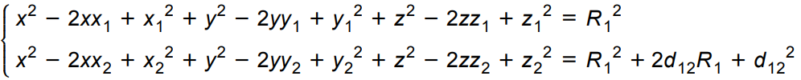

# Задание для ВАИС Техники

Задание для ВАИС Техники по вычислению координат объекта по данным спутников.

Программа выводит вычисленные координаты на каждый момент времени, а также итоговые координаты в самом конце. После вывода координат выполняется проверка найденного решения следующим образом:

1. Вычисляется *Δ1* (ошибка в измерении дальности) для одного момента времени;

2. Вычисляется *Δ2* для другого момента времени;

3. Находится модуль разности *Δ1* и *Δ2* (чем он ближе к ***0***, тем лучше);

4. Пункты 1-3 выполняются для каждой пары моментов и находится **среднее значение** разности для спутника.

5. Пункт 4 выполняется для каждого спутника и находится **общее среднее значение** для всех спутников;

   > Чем ближе **средние значения** и  **общее среднее занчение** к ***0***, тем лучше.

## Сборка и установка

```bash
git clone https://github.com/Arjentix/wise-tech-task
cd wise-tech-task
git submodule init
git submodule update
cmake -Bbuild . && cmake --build build --target install
```

## Запуск

```bash
bin/wise_tech_task <filename>
```

Если файл содержит много данных, то лучше использовать

```bash
bin/wise_tech_task <filename> > out.txt
```

Файл  с входными данными содержится в папке *resources*, так что можно запускать

```bash
bin/wise_tech_task resources/phase_task.txt > out.txt
```

## Математика

Составим систему уравнений для одного спутника в трех моментах времени:


, где 

* **x, y, z** – искомые координаты объекта;
* xi, yi, zi – координаты спутника в момент времени *i*;
* **Ri** – реальное расстояние от спутника до объекта в момент времени *i*;
* dij – разница между **Ri** и **Rj**. Вычисляется с помощью вычитания из измеренного расстояния до спутника **j** измеренного расстояния до спутника **i**.

Неизвестные величины выделены в системы жирным шрифтом. Рассмотрим уравнения 1, 2, 4 системы. Выразим R2 через R1 и раскроем скобки:



Вычтем из второго уравнения первое и выразим R1:


Обозначим:

* коэффициент при *x* как ***a1***;
* коэффициент при *y* как ***b1***;
* коэффициент при *z* как ***c1***;
* свободный член как ***k1***.

Аналогично поступаем с уравнениями 2, 3, 5 первой системы и R2, R3 соответственно. Получим:


Обозначим:

* коэффициент при *x* как ***a2***;
* коэффициент при *y* как ***b2***;
* коэффициент при *z* как ***c2***;
* свободный член как ***k2***.

ai, bi, ci, ki – известные величины.

Подставим полученные R1 и R2 в выражение 4 первой системы и перенесем все неизвестные величины влево, а известные вправо:


Получили линейное уравнение для 3 неизвестных.

Выполняя аналогичные действия для других спутников мы получим избыточную систему линейных уравнений для 3-х моментов времени, которую можно решить используя метод наименьших квадратов.

Благодаря этому можно начинать вычислять значения *x*, *y*, *z* начиная с 3-го измерения во времени.

> Программа суммирует данные от всех предыдущих моментов времени для получения более точной системы. Таким образом, вычисление на основе только 3-х моментов времени применяется только для самого 3-его момента.